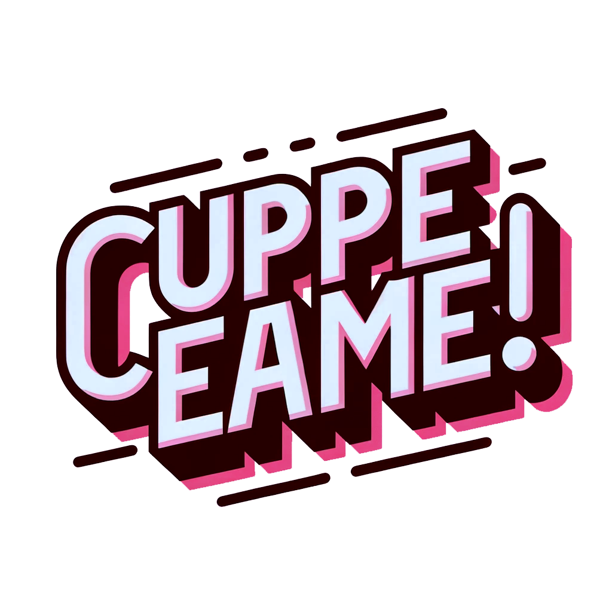
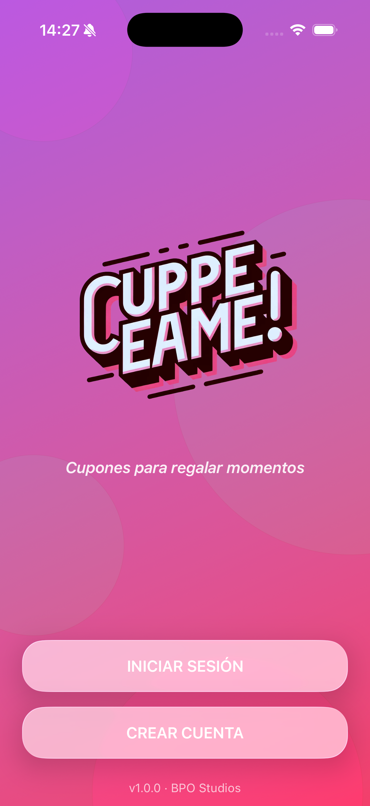
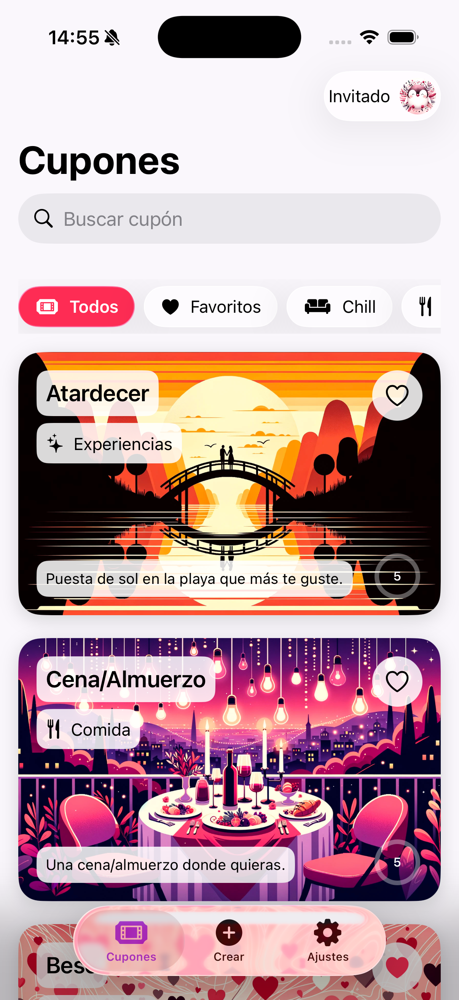
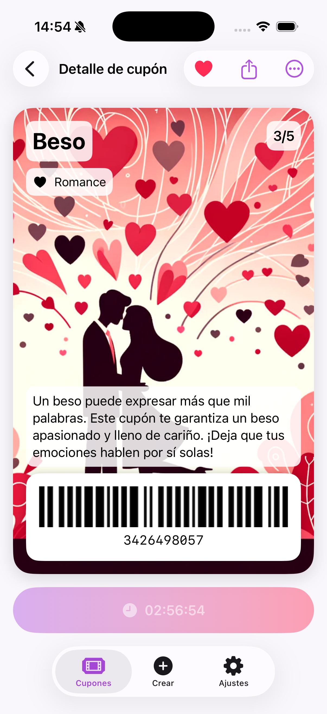
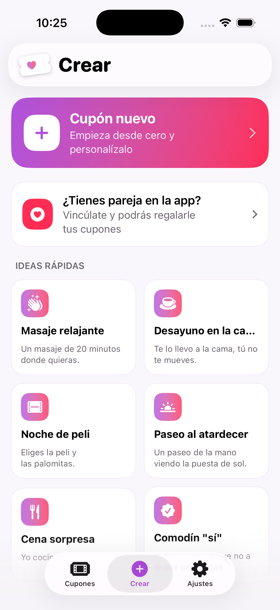
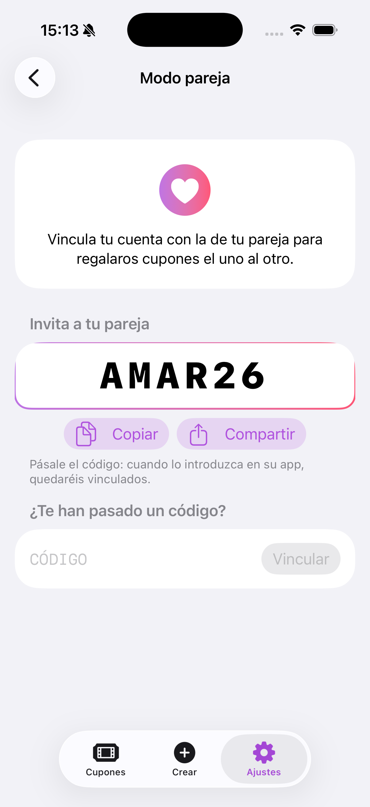
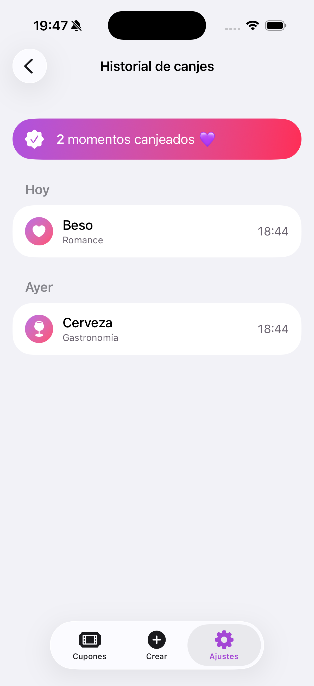
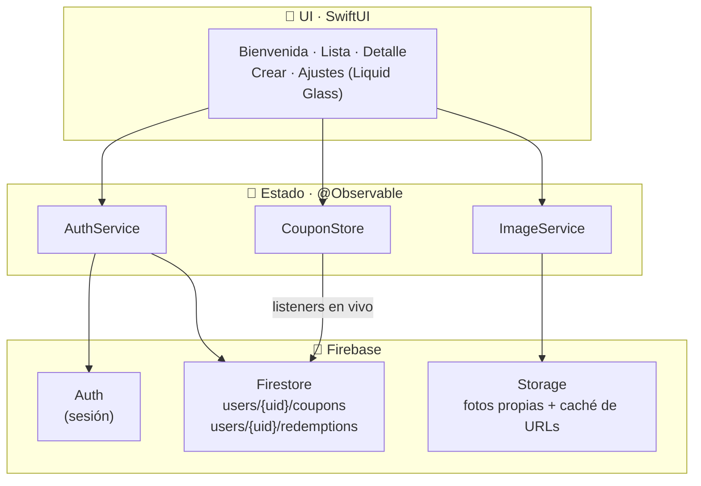

<div align="center">



# Cuponéame

**Cupones para regalar momentos a quien más quieres.**

App iOS nativa de cupones canjeables entre parejas: crea cupones personalizados con foto, canjéalos con tiempo de espera y límite de usos, y guarda cada momento en el historial. Estética *Liquid Glass* de iOS 26 sobre el gradiente morado→rosa de la marca.


</div>

---

## 📸 Capturas

<div align="center">

| Bienvenida | Lista | Detalle |
|:---:|:---:|:---:|
|  |  |  |
| **Crear** | **Modo pareja** | **Historial** |
|  |  |  |

<sub>Gradiente morado→rosa + Liquid Glass + tarjetas foto-a-sangre: el lenguaje visual de Cuponéame.</sub>

</div>

---

## ✨ Características

- 💑 **Modo pareja**: vincula dos cuentas con un **código de invitación** (6 caracteres, compartible por cualquier app) y **regalaos cupones** el uno al otro — desde Crear ("Para X 💝") o desde el detalle ("Regalar a X"). Los regalos llegan firmados con el chip "De X".
- 🎟️ **Cupones canjeables** con foto a sangre, chips blancos y anillo de usos restantes.
- ⏳ **Tiempo de espera real** entre canjeos, con cuenta atrás en vivo sobre el botón de canjear.
- 🧮 **Límite de usos** por cupón; al agotarse, la tarjeta pasa a escala de grises.
- ➕ **Crear y editar cupones**: galería del catálogo o **foto propia** (PhotosPicker → Firebase Storage, reescalada).
- ❤️ **Favoritos** y **filtros** por categoría con chips de cristal, más **buscador**.
- 📜 **Historial de canjes** agrupado por día (Hoy / Ayer / fecha).
- 📤 **Compartir** cupones por cualquier app (ShareLink).
- 🔐 **Cuenta con Firebase Auth**: sesión persistente, recuperar/cambiar contraseña, cambiar nombre y **eliminar cuenta** (requisito App Store).
- ⚙️ **Ajustes completos**: resumen con contadores, tema Sistema/Claro/Oscuro, compartir la app y enviar sugerencias.
- 🎁 **Pack de ejemplo**: 11 cupones para estrenar la cuenta (o restaurarlos desde Ajustes).
- 👤 **Modo demo** ("Probar sin cuenta"): toda la app funciona con datos locales en memoria — ideal para probarla y para la review de la App Store.
- 🧊 **Liquid Glass iOS 26** con fallback a materiales en iOS 17-25; modo claro y oscuro.
- 📶 Las imágenes del catálogo son locales: la lista funciona **sin conexión**.

---

## 🏗️ Arquitectura

MVVM ligero con inyección por entorno (patrón GasApp): la UI observa *stores* `@Observable`; los *stores* escuchan Firestore con listeners en vivo, así que cualquier cambio (propio o desde otro dispositivo) refresca la interfaz al momento.



### Estructura

```
cuponeame/
├── App/            # Entrada, FirebaseApp.configure() antes que los stores
├── Data/           # AuthService · CouponStore · ImageService
├── Shared/Models/  # Coupon · Redemption · DefaultCoupons (contrato Firestore)
├── UI/
│   ├── Theme/      # Paleta + gradiente de marca · helpers Liquid Glass
│   ├── Auth/       # Bienvenida · Login · Registro
│   ├── Coupons/    # Lista · Tarjeta · Detalle
│   ├── Create/     # Formulario crear/editar
│   └── Settings/   # Ajustes · Historial
└── Resources/      # Assets (fotos del catálogo en local)
```

### Contratos compartidos

> ⚠️ No cambiar sin migración: rompen los datos de cuentas existentes.

| Contrato | Valor |
|---|---|
| Campos Firestore de cupón | `title`, `category`, `description`, `short_description`, `imageName`, `used`, `cooldownTime`, `cooldownExpirationDate`, `redeemCount`, `redeemLimit` (+ nuevos `favorite`, `createdAt`, `from`) |
| Perfil `users/{uid}` | `name`, `email` (+ modo pareja: `partnerUID`, `partnerName`) |
| Invitaciones | `invites/{code}` → `ownerUID`, `ownerName`, `createdAt`; el código se consume al vincular |
| Rutas de imágenes del catálogo | `/defaults-coupons/*.jpg` (con espejo local en Assets) |
| Fotos propias | `user-images/{uid}/{uuid}.jpg` en Storage |

---

## 🚀 Puesta en marcha

```bash
brew install xcodegen
git clone git@github.com:DanielChineaDev/cuponeame.git && cd cuponeame
# Descargar GoogleService-Info.plist del proyecto Firebase "cuponeame-372cb"
# y colocarlo en cuponeame/Configurations/
xcodegen generate
open Cuponeame.xcodeproj
```

Los tests: esquema **Cuponeame** → ⌘U (27 tests: modelo, contrato Firestore, códigos de invitación y modo demo).

---

## 🗺️ Roadmap

- [x] Migración a XcodeGen + Firebase 12 + Liquid Glass
- [x] Crear/editar cupones con foto propia
- [x] Favoritos, filtros, buscador e historial
- [x] Modo demo para probar la app sin cuenta
- [x] **Modo pareja**: código de invitación, cuentas vinculadas y regalos de cupones
- [ ] Notificación push cuando tu pareja canjea o te regala un cupón
- [ ] Avatares personalizables (hoy: pingüino para todo el mundo 🐧)
- [ ] Widget con el próximo cupón disponible
- [ ] Reglas de seguridad de Firestore por usuario + App Check

---

<div align="center">
<sub>Hecho con 💜 por <b>BPO Studios</b></sub>
</div>
